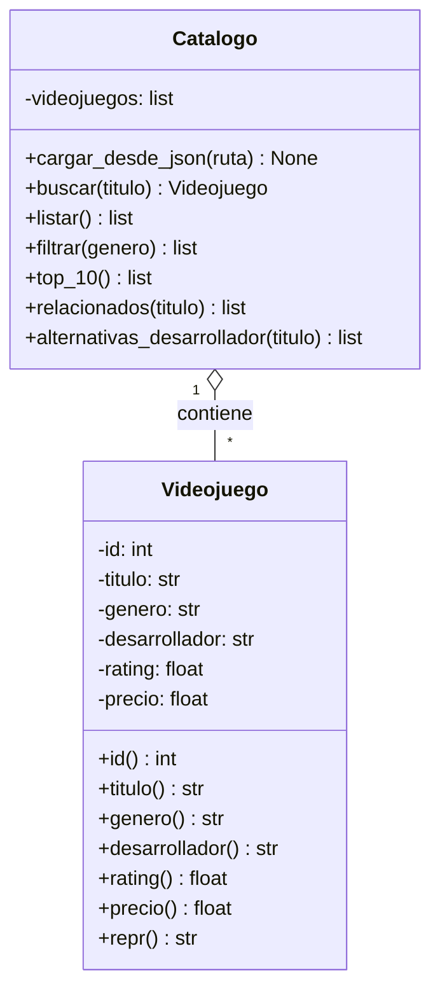

# Diagrama de clases

> Actualizado en TP1 con la implementación de la v1.



```text
> Buscar elemento
Título: Minecraft

╔══════════════════════════════════════╗
║           🎬 GAMeBOT                ║
╠══════════════════════════════════════╣
║ Si te gustó Minecraft, quizás te     ║
║ interesen:                           ║
║                                      ║
║ 1. Stardew Valley                    ║
║ 2. Don't Starve                      ║
║ 3. Terraria                          ║
║                                      ║
╚══════════════════════════════════════╝

